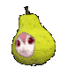

# dev-portfolio
My portfolio for projects & education achievements.

## Contents

| | |
|:--|:--|
|1|About: All about me.|
|2|Projects: Projects I contributed to.|
|3|Skills: All Programming languages and tools I'm good at.|
|4|Education: My current education journey.|

## Tech Stack
|Component|Technology|
|:--|:--|
|Frontend|React|
|Framework|Vite|
|Backend|JavaScript|
|Hosting|GitHub Pages|

Feel free to look around!  
 
